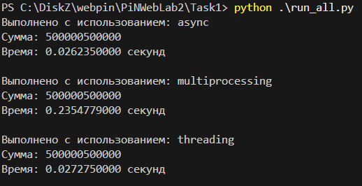
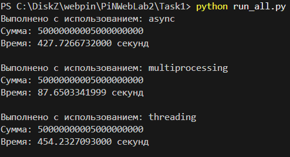

# Задача 1. Различия между threading, multiprocessing и async в Python

**Задача**: Напишите три различных программы на Python, использующие каждый из подходов: threading, multiprocessing и async. Каждая программа должна решать считать сумму всех чисел от 1 до 10000000000000. Разделите вычисления на несколько параллельных задач для ускорения выполнения.

## asyncio

```python
import asyncio

from consts import MAX_NUMBER, NUM_TASKS
from utils import timer_decorator, get_end_index


async def calculate_sum(start, end):
    total = 0
    for i in range(start, end):
        total += i
    return total

async def main():
    tasks = []
    chunk_size = MAX_NUMBER // NUM_TASKS

    @timer_decorator("async")
    async def exec():
        for i in range(NUM_TASKS):
            start = i * chunk_size + 1
            end = get_end_index(i, chunk_size, NUM_TASKS)
            
            task = asyncio.create_task(calculate_sum(start, end))
            tasks.append(task)

        results = await asyncio.gather(*tasks)

        return sum(results)

    await exec()

if __name__ == "__main__":
    asyncio.run(main())
```

## multiprocessing

```python
import multiprocessing

from consts import MAX_NUMBER, NUM_PROCESSES
from utils import timer_decorator, get_end_index


def calculate_sum(start, end, result_queue):
    total = 0
    for i in range(start, end):
        total += i
    result_queue.put(total)

def main():
    processes = []
    result_queue = multiprocessing.Queue()
    chunk_size = MAX_NUMBER // NUM_PROCESSES

    @timer_decorator("multiprocessing")
    def exec():
        for i in range(NUM_PROCESSES):
            start = i * chunk_size + 1
            end = get_end_index(i, chunk_size, NUM_PROCESSES)

            process = multiprocessing.Process(target=calculate_sum, args=(start, end, result_queue))
            processes.append(process)

        for process in processes:
            process.start()

        for process in processes:
            process.join()

        total_sum = 0
        while not result_queue.empty():
            total_sum += result_queue.get()
        return total_sum
    
    exec()

if __name__ == "__main__":
    main()
```

## threading

```python
import threading

from consts import MAX_NUMBER, NUM_THREADS
from utils import timer_decorator, get_end_index


def calculate_sum(start, end, result, index):
    total = 0
    for i in range(start, end):
        total += i
    result[index] = total

def main():
    threads = []
    result = [0] * NUM_THREADS
    chunk_size = MAX_NUMBER // NUM_THREADS

    @timer_decorator("threading")
    def exec():
        for i in range(NUM_THREADS):
            start = i * chunk_size + 1
            end = get_end_index(i, chunk_size, NUM_THREADS)

            thread = threading.Thread(target=calculate_sum, args=(start, end, result, i))
            threads.append(thread)

        for thread in threads:
            thread.start()

        for thread in threads:
            thread.join()

        return sum(result)

    exec()

if __name__ == "__main__":
    main()
```

## Результаты

Для 1 миллиона



Для 10 миллиардов



## Вывод

Для интенсивных вычислений стоит использовать multiprocessing, так как он обходит GIL и
позволяет задействовать все доступные ядра процессора, что можно заметить по картинке для
10 миллиардов. Но как видно для неинтенсивных вычислений стоит брать уже async или threading
(разница по времени между ними небольшая), так как, видимо, очень много времени тратится для
создания процесса, что можно заметить по картинке для 1 миллиона.
