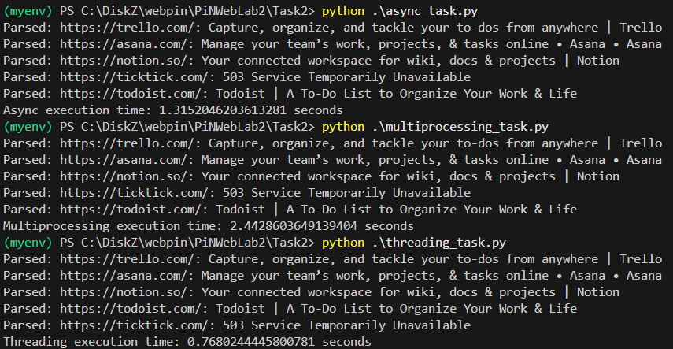

# Задача 2. Параллельный парсинг веб-страниц с сохранением в базу данных

**Задача**: Напишите программу на Python для параллельного парсинга нескольких веб-страниц с сохранением данных в базу данных с использованием подходов threading, multiprocessing и async. Каждая программа должна парсить информацию с нескольких веб-сайтов, сохранять их в базу данных.

## models

```python
from sqlmodel import Field, SQLModel


class WebPage(SQLModel, table=True):
    id: int | None = Field(default=None, primary_key=True)
    url: str
    title: str

```

## parse and save for async

```python
from bs4 import BeautifulSoup

from connection_async import SessionLocal_async
from models import WebPage


async def parse_and_save_async(url, session):
    try:
        async with session.get(url) as response:
            text = await response.text()
            soup = BeautifulSoup(text, 'html.parser')
            title = soup.title.string if soup.title else 'No title'

            async with SessionLocal_async() as db_session:
                page = WebPage(url=url, title=title)
                db_session.add(page)
                await db_session.commit()
        print(f"Parsed: {url}: {title}")
    except Exception as e:
        print(f"Error parsing {url}: {e}")
```

## asyncio

```python
import aiohttp
import asyncio
import time

from urls import urls
from parse_and_save_async import parse_and_save_async
from connection_async import init_db_async


async def main():
    await init_db_async()
    
    async with aiohttp.ClientSession() as session:
        tasks = [parse_and_save_async(url, session) for url in urls]
        await asyncio.gather(*tasks)

if __name__ == "__main__":
    start_time = time.time()
    asyncio.run(main())
    end_time = time.time()
    print(f"Async execution time: {end_time - start_time} seconds")
```

## parse and save

```python
from bs4 import BeautifulSoup
import requests

from connection import SessionLocal
from models import WebPage


def parse_and_save(url):
    try:
        response = requests.get(url)
        soup = BeautifulSoup(response.text, 'html.parser')
        title = soup.title.string if soup.title else 'No title'

        with SessionLocal() as session:
            page = WebPage(url=url, title=title)
            session.add(page)
            session.commit()
        print(f"Parsed: {url}: {title}")
    except Exception as e:
        print(f"Error parsing {url}: {e}")
```

## multiprocessing

```python
import multiprocessing
import time

from connection import init_db
from urls import urls
from parse_and_save import parse_and_save


def main():
    init_db()
    
    processes = []
    start_time = time.time()

    for url in urls:
        process = multiprocessing.Process(target=parse_and_save, args=(url,))
        processes.append(process)

    for process in processes:
        process.start()

    for process in processes:
        process.join()

    end_time = time.time()
    print(f"Multiprocessing execution time: {end_time - start_time} seconds")

if __name__ == "__main__":
    main()
```

## threading

```python
import threading
import time

from connection import init_db
from urls import urls
from parse_and_save import parse_and_save


def main():
    init_db()
    
    threads = []
    start_time = time.time()

    for url in urls:
        thread = threading.Thread(target=parse_and_save, args=(url,))
        threads.append(thread)
    
    for thread in threads:
        thread.start()

    for thread in threads:
        thread.join()

    end_time = time.time()
    print(f"Threading execution time: {end_time - start_time} seconds")

if __name__ == "__main__":
    main()
```

## Результаты

Парсинг одного сайта


Парсинг пяти сайтов



## Вывод

Тут уже более интересные результаты: для одного сайта async и threading показали одинаковые
результаты, а multiprocessing показал ожидаемо низкий результат, так как никаких интенсивных
вычислений в логике программы не было, но для 5 сайтов вышел вперед подход threading, что я
объяснить так и не смог, так как я сделал все для того чтобы асинхронность тоже показала
хороший результат.

Немного почитав, я узнал, что есть слишком много факторов влияющих на aiohttp и их невозможно
все учесть. Где-то говорят, что нестабильно работает, а где-то говорят, что прокси может
сильно замедлить, хотя я его и не использовал, но все же, как факт.
